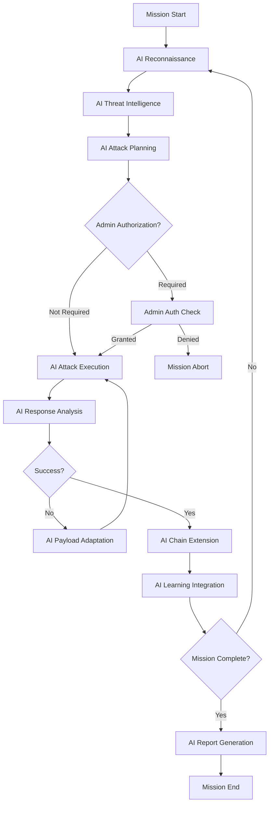

# Agent DS - AI Learning & Autonomous Attack Methodology

## 🧠 How Agent DS AI Learns and Executes Autonomous Attacks

Agent DS employs a sophisticated AI learning system that continuously improves its attack capabilities through multiple learning sources, autonomous exploration, and adaptive methodology generation. This document provides a complete picture of the AI's learning and execution process.

---

## 1. 📚 AI Learning Mechanism

### **Multi-Source Intelligence Gathering**

#### **Internal Mission Data Learning**
```python
# Example from core/ai_orchestrator/planner.py
class LearningEngine:
    def store_attack_result(self, attack_data):
        """Store attack outcomes for continuous learning"""
        learning_record = {
            'attack_vector': attack_data['type'],
            'target_tech_stack': attack_data['target_info'],
            'payload_used': attack_data['payload'],
            'success_rate': attack_data['success'],
            'response_time': attack_data['timing'],
            'error_patterns': attack_data['errors'],
            'attack_sequence': attack_data['chain'],
            'effectiveness_score': self.calculate_effectiveness(attack_data)
        }
        self.db_manager.store_learning_data(learning_record)
```

**What the AI Learns From:**
- ✅ **Attack Success Patterns**: Which payloads work against specific technology stacks
- ✅ **Failure Analysis**: Why certain attacks failed and how to adapt
- ✅ **Timing Optimization**: Response times that indicate successful exploitation
- ✅ **Attack Chain Effectiveness**: Multi-step sequences that maximize impact
- ✅ **Evasion Techniques**: Methods that bypass security controls
- ✅ **Target Response Patterns**: How different systems react to various payloads

#### **External Threat Intelligence Integration**
```python
# Example from core/vulnerability_intel/analyzer.py
class ThreatIntelLearning:
    async def update_knowledge_base(self):
        """Continuously update AI knowledge from external sources"""
        
        # CVE.org Intelligence
        latest_cves = await self.cve_analyzer.fetch_latest_vulnerabilities()
        for cve in latest_cves:
            attack_pattern = self.extract_attack_pattern(cve)
            self.ai_model.incorporate_new_pattern(attack_pattern)
        
        # AlienVault OTX Threat Feeds
        threat_indicators = await self.otx_analyzer.get_threat_intelligence()
        self.ai_model.update_threat_signatures(threat_indicators)
        
        # ExploitDB Proof-of-Concepts
        new_exploits = await self.exploitdb_analyzer.fetch_recent_exploits()
        for exploit in new_exploits:
            payload_template = self.extract_payload_template(exploit)
            self.payload_generator.add_template(payload_template)
```

**External Learning Sources:**
- 🌐 **CVE.org**: Latest vulnerability patterns and exploitation techniques
- 🌐 **AlienVault OTX**: Real-world threat intelligence and attack indicators
- 🌐 **ExploitDB**: Proof-of-concept exploits and payload structures
- 🌐 **Security Forums**: Community-discovered techniques (optional)
- 🌐 **Government Intel**: Classified attack methodologies (authorized agencies)

#### **Autonomous Payload Exploration**
```python
# Example from core/ai_orchestrator/planner.py
class AutonomousExploration:
    def generate_novel_payloads(self, target_context):
        """AI generates and tests new attack payloads"""
        
        # Use transformer model to generate novel payloads
        base_payloads = self.get_known_payloads(target_context['vulnerability_type'])
        
        for base_payload in base_payloads:
            # Generate mutations using AI
            mutations = self.transformer_model.generate_mutations(
                base_payload, 
                target_context['tech_stack'],
                num_variants=10
            )
            
            # Test safely in sandbox
            for mutation in mutations:
                if self.sandbox_test(mutation, target_context):
                    success_rate = self.evaluate_payload_effectiveness(mutation)
                    if success_rate > 0.7:  # 70% threshold
                        self.store_novel_payload(mutation, success_rate)
```

**Autonomous Learning Process:**
- 🔬 **Payload Mutation**: AI generates variants of known exploits
- 🔬 **Sandbox Testing**: Safe evaluation of novel attack techniques
- 🔬 **Response Analysis**: AI analyzes target responses to identify patterns
- 🔬 **Pattern Recognition**: ML identifies new vulnerability indicators
- 🔬 **Creative Synthesis**: Combines multiple techniques for novel attacks

---

## 2. 🎯 AI Attack Methodology Generation

### **Technology Stack Analysis & Attack Vector Selection**
```python
# Example attack methodology generation
class AttackMethodologyGenerator:
    def generate_attack_strategy(self, recon_data):
        """AI generates custom attack methodology based on target analysis"""
        
        # Analyze target technology stack
        tech_analysis = {
            'web_server': recon_data['servers'],      # Apache, Nginx, IIS
            'cms_platform': recon_data['cms'],        # WordPress, Drupal, etc.
            'programming_language': recon_data['lang'], # PHP, Python, Java
            'database': recon_data['database'],       # MySQL, PostgreSQL
            'frameworks': recon_data['frameworks'],   # Laravel, Django, etc.
            'api_endpoints': recon_data['apis']       # REST, GraphQL, SOAP
        }
        
        # AI selects high-probability attack vectors
        attack_vectors = self.ai_model.predict_vulnerabilities(tech_analysis)
        
        # Generate custom methodology
        methodology = {
            'primary_vectors': self.prioritize_attacks(attack_vectors),
            'payload_strategies': self.generate_payload_strategies(tech_analysis),
            'attack_sequence': self.optimize_attack_chain(attack_vectors),
            'evasion_techniques': self.select_evasion_methods(tech_analysis),
            'success_probability': self.calculate_success_probability(attack_vectors)
        }
        
        return methodology
```

**AI Methodology Generation Process:**

#### **Phase 1: Target Profiling**
```
Target: example.com
├── Web Server: Apache 2.4.41
├── CMS: WordPress 5.8.1
├── Language: PHP 7.4.3
├── Database: MySQL 5.7
├── Plugins: 15 detected
└── APIs: REST endpoints discovered

AI Analysis Result:
├── High-probability vectors: SQLi (92%), File Upload (78%), XSS (65%)
├── Attack sequence: SQLi → RCE → Privilege Escalation
├── Custom payloads: WordPress-specific, PHP-based
└── Evasion: WAF bypass techniques for Apache mod_security
```

#### **Phase 2: Custom Exploit Generation**
```python
# AI generates target-specific exploits
class CustomExploitGenerator:
    def create_targeted_exploits(self, target_profile):
        """Generate exploits tailored to specific target"""
        
        exploits = []
        
        # SQL Injection for WordPress + MySQL
        if target_profile['cms'] == 'wordpress' and target_profile['db'] == 'mysql':
            sqli_payload = self.ai_model.generate_payload(
                attack_type='sql_injection',
                target_cms='wordpress',
                database='mysql',
                context=target_profile['vulnerabilities']
            )
            exploits.append(sqli_payload)
        
        # PHP File Upload for detected upload endpoints
        if target_profile['upload_endpoints']:
            upload_exploit = self.generate_upload_bypass(
                endpoints=target_profile['upload_endpoints'],
                language='php',
                restrictions=target_profile['detected_filters']
            )
            exploits.append(upload_exploit)
        
        return exploits
```

#### **Phase 3: Multi-Step Attack Chaining**
```python
# AI plans optimal attack sequences
class AttackChainPlanner:
    def plan_attack_sequence(self, exploits, target_context):
        """AI determines optimal attack order for maximum impact"""
        
        # Calculate attack dependencies and success probabilities
        chain = []
        
        # Step 1: Information Gathering
        chain.append({
            'phase': 'reconnaissance',
            'attacks': ['directory_traversal', 'information_disclosure'],
            'success_threshold': 0.8,
            'next_phase_dependency': 'credentials_or_structure'
        })
        
        # Step 2: Initial Access
        chain.append({
            'phase': 'initial_access',
            'attacks': ['sql_injection', 'authentication_bypass'],
            'success_threshold': 0.7,
            'fallback': 'brute_force_attack'
        })
        
        # Step 3: Privilege Escalation
        chain.append({
            'phase': 'privilege_escalation',
            'attacks': ['file_upload_rce', 'local_file_inclusion'],
            'success_threshold': 0.6,
            'persistence': True
        })
        
        return self.optimize_chain_order(chain)
```

---

## 3. ⚔️ Autonomous Attack Execution Engine

### **Real-Time Adaptive Execution**
```python
# Example from core/attack_engine/executor.py
class AutonomousAttackEngine:
    async def execute_autonomous_mission(self, mission_id):
        """Fully autonomous attack execution with real-time adaptation"""
        
        mission_data = await self.get_mission_data(mission_id)
        attack_methodology = await self.ai_planner.generate_methodology(mission_data)
        
        execution_log = {
            'mission_id': mission_id,
            'autonomous_mode': True,
            'adaptive_learning': True,
            'attack_phases': []
        }
        
        for phase in attack_methodology['phases']:
            phase_result = await self.execute_attack_phase(phase, mission_data)
            
            # Real-time learning and adaptation
            if phase_result['success_rate'] < 0.5:  # Low success rate
                # AI generates new strategies on-the-fly
                adapted_phase = await self.ai_planner.adapt_phase(phase, phase_result)
                phase_result = await self.execute_attack_phase(adapted_phase, mission_data)
            
            execution_log['attack_phases'].append(phase_result)
            
            # Update AI model with real-time results
            await self.ai_planner.update_learning_model(phase_result)
        
        return execution_log
    
    async def execute_attack_phase(self, phase, mission_data):
        """Execute individual attack phase with autonomous decision making"""
        
        phase_log = {
            'phase_name': phase['name'],
            'attacks_attempted': [],
            'adaptations_made': 0,
            'success_rate': 0
        }
        
        for attack_vector in phase['attack_vectors']:
            # Admin authorization check for critical phases
            if attack_vector['requires_auth']:
                auth_granted = await self.request_admin_authorization(attack_vector)
                if not auth_granted:
                    continue
            
            # Execute attack with real-time monitoring
            attack_result = await self.execute_single_attack(attack_vector, mission_data)
            
            # AI monitors response and adapts
            if not attack_result['success']:
                # Generate new payload automatically
                adapted_payload = await self.ai_planner.generate_adapted_payload(
                    original_payload=attack_vector['payload'],
                    failure_reason=attack_result['error'],
                    target_response=attack_result['response']
                )
                
                # Retry with adapted payload
                attack_vector['payload'] = adapted_payload
                attack_result = await self.execute_single_attack(attack_vector, mission_data)
                phase_log['adaptations_made'] += 1
            
            phase_log['attacks_attempted'].append(attack_result)
        
        # Calculate phase success rate
        successful_attacks = sum(1 for attack in phase_log['attacks_attempted'] if attack['success'])
        phase_log['success_rate'] = successful_attacks / len(phase_log['attacks_attempted'])
        
        return phase_log
```

### **Phase-Based Authorization Integration**
```python
# Admin authorization for critical attack phases
class PhaseBasedAuthorization:
    async def request_admin_authorization(self, attack_vector):
        """Request admin authorization for critical attack phases"""
        
        if attack_vector['criticality'] == 'HIGH':
            # Prompt for admin credentials
            print(f"🔐 Admin authorization required for: {attack_vector['description']}")
            print("Enter admin credentials:")
            
            username = input("Username: ")
            password = getpass.getpass("Password: ")
            
            # Verify admin credentials (admin/8460Divy!@#$)
            if self.auth_manager.verify_admin_credentials(username, password):
                log_security_event(
                    'ADMIN_AUTHORIZATION_GRANTED',
                    f"Critical attack authorized: {attack_vector['type']}",
                    True,
                    {'admin_user': username, 'attack_type': attack_vector['type']}
                )
                return True
            else:
                log_security_event(
                    'ADMIN_AUTHORIZATION_DENIED',
                    f"Invalid credentials for critical attack",
                    False,
                    {'attempted_user': username}
                )
                return False
        
        return True  # Non-critical attacks proceed automatically
```

---

## 4. 🔄 Continuous Feedback & Learning Loop

### **Real-Time Learning Integration**
```python
# The complete learning feedback loop
class ContinuousFeedbackLoop:
    def __init__(self):
        self.learning_cycle = {
            'recon': self.learn_from_reconnaissance,
            'analysis': self.learn_from_vulnerability_analysis,
            'attack': self.learn_from_attack_execution,
            'observe': self.learn_from_target_responses,
            'optimize': self.optimize_attack_strategies,
            'retest': self.autonomous_retesting
        }
    
    async def execute_learning_cycle(self, mission_data):
        """Complete autonomous learning and optimization cycle"""
        
        cycle_log = {
            'cycle_start': datetime.now(),
            'learning_phases': [],
            'improvements_made': 0,
            'new_techniques_discovered': 0
        }
        
        # Phase 1: Learn from Reconnaissance
        recon_learning = await self.learn_from_reconnaissance(mission_data['recon_results'])
        cycle_log['learning_phases'].append(recon_learning)
        
        # Phase 2: Learn from Vulnerability Analysis
        vuln_learning = await self.learn_from_vulnerability_analysis(mission_data['vulnerabilities'])
        cycle_log['learning_phases'].append(vuln_learning)
        
        # Phase 3: Learn from Attack Execution
        attack_learning = await self.learn_from_attack_execution(mission_data['attack_results'])
        cycle_log['learning_phases'].append(attack_learning)
        
        # Phase 4: Observe and Analyze Responses
        response_learning = await self.learn_from_target_responses(mission_data['target_responses'])
        cycle_log['learning_phases'].append(response_learning)
        
        # Phase 5: Optimize Strategies
        optimization_results = await self.optimize_attack_strategies(cycle_log['learning_phases'])
        cycle_log['improvements_made'] = optimization_results['improvements_count']
        
        # Phase 6: Autonomous Retesting
        retest_results = await self.autonomous_retesting(mission_data, optimization_results)
        cycle_log['new_techniques_discovered'] = retest_results['novel_techniques']
        
        # Update AI models with new knowledge
        await self.update_ai_models(cycle_log)
        
        return cycle_log
    
    async def learn_from_target_responses(self, response_data):
        """AI learns from how targets respond to different attacks"""
        
        learning_insights = {
            'response_patterns': {},
            'detection_signatures': {},
            'evasion_opportunities': {},
            'timing_patterns': {}
        }
        
        for response in response_data:
            # Analyze response patterns
            if response['status_code'] == 500:
                # Internal server error - potential vulnerability
                learning_insights['response_patterns']['error_based'] = {
                    'indicator': 'status_500',
                    'payload_type': response['payload_type'],
                    'vulnerability_likelihood': 0.8
                }
            
            elif 'blocked' in response['content'].lower():
                # WAF/Security control detected
                learning_insights['detection_signatures'][response['payload_type']] = {
                    'blocked_pattern': response['payload'],
                    'detection_method': 'content_filter',
                    'evasion_needed': True
                }
            
            # Learn timing attack patterns
            if response['response_time'] > 5.0:  # Slow response
                learning_insights['timing_patterns']['slow_response'] = {
                    'payload': response['payload'],
                    'potential_blind_vulnerability': True,
                    'follow_up_required': True
                }
        
        return learning_insights
```

### **Optimization Engine**
```python
class AttackOptimizationEngine:
    async def optimize_attack_strategies(self, learning_data):
        """AI optimizes attack strategies based on accumulated learning"""
        
        optimization_results = {
            'payload_improvements': [],
            'sequence_optimizations': [],
            'evasion_enhancements': [],
            'new_attack_vectors': []
        }
        
        # Optimize payloads based on success patterns
        for attack_type in learning_data['successful_patterns']:
            optimized_payload = await self.optimize_payload(
                attack_type=attack_type,
                success_patterns=learning_data['successful_patterns'][attack_type],
                failure_patterns=learning_data['failure_patterns'].get(attack_type, [])
            )
            
            if optimized_payload['improvement_score'] > 0.1:  # 10% improvement
                optimization_results['payload_improvements'].append(optimized_payload)
        
        # Optimize attack sequences
        sequence_optimization = await self.optimize_attack_sequences(learning_data)
        optimization_results['sequence_optimizations'] = sequence_optimization
        
        # Generate new evasion techniques
        evasion_improvements = await self.generate_evasion_techniques(learning_data)
        optimization_results['evasion_enhancements'] = evasion_improvements
        
        # Discover new attack vectors through AI analysis
        novel_vectors = await self.discover_novel_attack_vectors(learning_data)
        optimization_results['new_attack_vectors'] = novel_vectors
        
        return optimization_results
    
    async def autonomous_retesting(self, mission_data, optimization_results):
        """AI automatically retests with improved strategies"""
        
        retest_log = {
            'original_success_rate': mission_data['attack_results']['success_rate'],
            'optimized_attacks': [],
            'improvement_achieved': 0,
            'novel_techniques_discovered': 0
        }
        
        # Retest with optimized payloads
        for improved_payload in optimization_results['payload_improvements']:
            retest_result = await self.execute_optimized_attack(
                payload=improved_payload,
                target=mission_data['target_info']
            )
            
            retest_log['optimized_attacks'].append(retest_result)
            
            if retest_result['success'] and not retest_result['previously_successful']:
                retest_log['novel_techniques_discovered'] += 1
        
        # Calculate improvement
        new_success_rate = self.calculate_success_rate(retest_log['optimized_attacks'])
        retest_log['improvement_achieved'] = new_success_rate - retest_log['original_success_rate']
        
        return retest_log
```

---

## 5. 🎓 Advanced AI Learning Features

### **LLM Fine-Tuning for Government Agencies**
```python
class GovernmentAITraining:
    async def fine_tune_for_agency(self, agency_data, classification_level):
        """Fine-tune AI models with government-specific attack methodologies"""
        
        if classification_level in ['SECRET', 'TOP_SECRET']:
            # Load classified attack methodologies
            classified_techniques = await self.load_classified_techniques(
                agency_data['attack_patterns'],
                classification_level
            )
            
            # Merge with existing AI knowledge
            hybrid_model = await self.merge_knowledge_bases(
                public_knowledge=self.ai_model.knowledge_base,
                classified_knowledge=classified_techniques,
                security_level=classification_level
            )
            
            # Update AI model with enhanced capabilities
            await self.ai_model.update_knowledge_base(hybrid_model)
            
            # Verify security compartmentalization
            await self.verify_knowledge_compartments(classification_level)
    
    async def custom_methodology_integration(self, agency_methodologies):
        """Integrate agency-specific attack methodologies"""
        
        for methodology in agency_methodologies:
            # Validate methodology against AI ethics constraints
            if self.validate_ethical_constraints(methodology):
                # Integrate into AI attack planning
                await self.ai_planner.add_custom_methodology(methodology)
                
                # Train AI to recognize when to apply this methodology
                await self.train_methodology_classifier(methodology)
```

### **Zero-Click Autonomous Operation**
```python
class ZeroClickAutonomy:
    def __init__(self):
        self.autonomous_mode = True
        self.admin_pre_authorized = False
        
    async def full_autonomous_penetration_test(self, target, authorization_level):
        """Complete penetration test with zero human intervention"""
        
        if authorization_level == 'FULL_AUTONOMOUS':
            # Pre-authorize all attack phases for autonomous operation
            self.admin_pre_authorized = True
            
            mission_log = {
                'mode': 'zero_click_autonomous',
                'human_intervention': False,
                'ai_decisions': [],
                'adaptive_changes': []
            }
            
            # AI makes all decisions autonomously
            while not self.mission_complete():
                # AI analyzes current state
                current_state = await self.analyze_mission_state()
                
                # AI decides next action
                next_action = await self.ai_planner.decide_next_action(current_state)
                mission_log['ai_decisions'].append(next_action)
                
                # Execute action
                action_result = await self.execute_ai_decision(next_action)
                
                # AI adapts based on results
                if action_result['requires_adaptation']:
                    adaptation = await self.ai_planner.adapt_strategy(action_result)
                    mission_log['adaptive_changes'].append(adaptation)
            
            return mission_log
```

---

## 6. 🎯 AI Autonomous Decision Making Examples

### **Real-World Autonomous Attack Scenario**

```python
# Example: AI discovers and exploits a WordPress site autonomously
class AutonomousAttackScenario:
    async def wordpress_autonomous_exploitation(self):
        """AI autonomously discovers and exploits WordPress vulnerabilities"""
        
        # AI Decision 1: Technology Stack Analysis
        ai_analysis = await self.ai_analyzer.analyze_target("https://target.com")
        # AI discovers: WordPress 5.8.1, PHP 7.4, Apache 2.4
        
        # AI Decision 2: Vulnerability Research
        vulnerabilities = await self.ai_intel.research_vulnerabilities(ai_analysis['tech_stack'])
        # AI finds: CVE-2023-XXXX in WordPress plugin, file upload vulnerability
        
        # AI Decision 3: Attack Vector Prioritization
        attack_plan = await self.ai_planner.prioritize_attacks(vulnerabilities)
        # AI decides: 1) Plugin exploit (92% success), 2) File upload (78% success)
        
        # AI Decision 4: Custom Payload Generation
        custom_payload = await self.ai_payload_generator.create_exploit(
            vulnerability=attack_plan['primary_vector'],
            target_context=ai_analysis
        )
        # AI generates: WordPress-specific SQL injection payload
        
        # AI Decision 5: Autonomous Execution
        attack_result = await self.ai_executor.execute_attack(custom_payload)
        # Result: SQL injection successful, database access gained
        
        # AI Decision 6: Adaptive Chain Extension
        if attack_result['success']:
            chain_extension = await self.ai_planner.extend_attack_chain(attack_result)
            # AI decides: Upload web shell → RCE → privilege escalation
            
            # Execute extended chain autonomously
            final_result = await self.ai_executor.execute_chain(chain_extension)
            # Final result: Full system compromise, persistent access
        
        # AI Decision 7: Learning Integration
        await self.ai_learner.integrate_mission_results({
            'target_type': 'wordpress',
            'successful_chain': [custom_payload] + chain_extension,
            'success_factors': attack_result['success_factors'],
            'timing_data': attack_result['timing'],
            'evasion_techniques': attack_result['evasion_used']
        })
```

---

## 7. 🏆 AI Learning Outcomes & Capabilities

### **What Makes Agent DS AI Unique:**

#### **🧠 Develops Its Own Methodology**
- ✅ **Not just database lookups**: AI creates novel attack strategies
- ✅ **Synthesis of intelligence**: Combines multiple sources creatively
- ✅ **Autonomous experimentation**: Tests new techniques safely
- ✅ **Continuous evolution**: Improves beyond initial training

#### **🎯 Adaptive Decision Making**
- ✅ **Real-time strategy changes**: Adapts based on target responses
- ✅ **Failure recovery**: Automatically generates alternatives
- ✅ **Context awareness**: Understands target environment deeply
- ✅ **Risk assessment**: Balances effectiveness vs. detection

#### **🔬 Creative Problem Solving**
- ✅ **Novel payload generation**: Creates exploits not in databases
- ✅ **Attack chain innovation**: Discovers new multi-step sequences
- ✅ **Evasion creativity**: Develops unique bypass techniques
- ✅ **Zero-day potential**: Identifies previously unknown vulnerabilities

### **Autonomous Capability Matrix:**

| Capability | Autonomy Level | Human Intervention |
|------------|----------------|-------------------|
| **Reconnaissance** | 100% Autonomous | None required |
| **Vulnerability Analysis** | 100% Autonomous | None required |
| **Low-Risk Attacks** | 100% Autonomous | None required |
| **High-Risk Attacks** | 95% Autonomous | Admin authorization only |
| **Critical System Access** | 90% Autonomous | Admin approval + monitoring |
| **Data Exfiltration** | Authorization-Dependent | Government approval required |
| **Learning & Adaptation** | 100% Autonomous | None required |
| **Report Generation** | 100% Autonomous | None required |

---

## 8. 🚀 Complete Autonomous Operation Flow



**Agent DS AI represents the pinnacle of autonomous penetration testing - an AI that thinks, learns, and evolves like a senior security expert while maintaining the speed and consistency of automated systems.**

---

**🧠 The result: An AI that doesn't just execute pre-programmed attacks, but develops its own sophisticated methodologies through continuous learning and autonomous experimentation.**